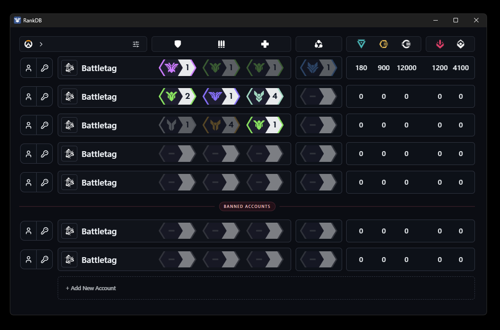

# RankDB

RankDB is a multi-account rank tracker for Overwatch players.

## Install

- Go to `Releases` on the right side of the GitHub repo and download the Windows installer.
- After the first install, future desktop updates can come through the app's `Settings -> Check for Updates` button once GitHub release updates are published.

## Windows Warning

This app is currently not code-signed, so Windows Defender / SmartScreen may show a warning like `Unknown Publisher` or `Windows protected your PC`.

This happens because the app does not yet have a digital code-signing certificate. Those certificates are usually paid and can be expensive for small indie or personal projects.

Because of that missing code-signing certificate, Windows may flag the installer even though it is not malicious.

## What The App Tracks

Each account row can store:

- Battletag
- Email / Password with easy copy-paste access
- Custom notes for the account
- Ranks for `Tank`, `Damage`, `Support`, and `6v6`
- Trackable currency: Mythic Prisms, Overwatch Coins, Overwatch Credits, and both Competitive Point types

## Main Functions

### Account Management

- Add and remove accounts
- Drag accounts to reorder them
- Copy battletags, emails, and passwords directly from the account bar
- Edit account credentials by right-clicking an account
- Edit account info such as country, notes, and banned status by right-clicking an account

### Rank Management

- Click a rank badge to open the rank picker
- Set tier and division for each role
- `P` rank stands for Predicted and is shown with lower opacity
- Track `6v6` separately from role queue

### Sorting

- Click a role icon in the header to cycle sorting from highest to lowest, then lowest to highest, then back to custom order
- Right-click a role icon to jump straight back to custom order

### Banned Accounts

- Accounts can be marked as banned in the Account Info modal
- Banned accounts are placed in their own section below normal accounts
- They sort within their own section only
- They cannot be dragged into the normal account section

### Settings

The settings include:

- Toggle for currency columns
- Toggle for `6v6` ranks
- Toggle for rank badge animations
- UI zoom slider
- Clipboard auto-clear timer
- Encrypted backup export
- Encrypted backup import
- Manual `Check for Updates` button in the desktop app

## Data Behavior

- Data is stored locally on your machine
- UI settings are stored separately from account data
- In the desktop app, data is stored in RankDB's own protected local database
- The local database key is stored in the operating system's secure keychain via `keyring`
- Changes save automatically

## Backup Format

- Import and export use the app's encrypted `.rankdb-export` backup format only
- Legacy plain JSON backups are no longer supported

## Migration Notes

- Legacy Windows Credential Manager migration is no longer supported
- Existing users should expect to re-enter their credentials one final time
- After that, use encrypted `.rankdb-export` backups going forward
