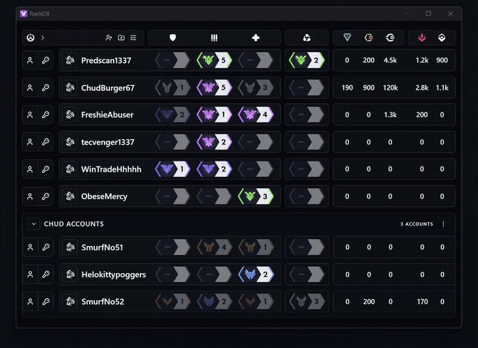

# RankDB

RankDB is a simple desktop app for tracking multiple Overwatch accounts in one place.

It helps you keep account ranks, notes, currencies, and login details organized without needing a spreadsheet.

## What It Does

- Tracks multiple Overwatch accounts in one app
- Stores ranks for `Tank`, `Damage`, `Support`, and `6v6`
- Stores Battletags, email/password details, notes, and country info
- Tracks `Mythic Prisms`, `Overwatch Coins`, `Overwatch Credits`, `Competitive Points`, and `Legacy Points`
- Lets you group accounts and reorder them
- Separates banned accounts into their own section
- Supports encrypted backup export and import
- Supports desktop app updates through GitHub Releases

## Windows Warning

RankDB is not code-signed right now.

Because of that, Windows may show a warning like `Unknown Publisher` or `Windows protected your PC` when opening the installer.

This is expected for now. A code-signing certificate costs money, and the project does not currently have one.

## Main Features

- Add, edit, remove, and reorder accounts
- Copy Battletags, emails, and passwords directly from the app
- Set ranks with a simple rank picker
- Mark ranks as predicted
- Create collapsible groups for account organization
- Export encrypted `.rankdb-export` backup files
- Import encrypted backup files on another PC
- Check for app updates from inside the desktop app

## Storage And Security

RankDB is built to keep your data local.

- Your account data stays on your own machine
- Backup exports are password-protected
- Rank refresh only contacts an external service when you choose to use it

As always, keep your PC secure and use a strong device password if you store account details locally.

## Install

Go to the repository `Releases` section and download the latest Windows installer.

After the first install, future updates can be checked from inside the app when a new GitHub release is available.

## Backup Notes

- The app uses encrypted `.rankdb-export` backups
- Legacy plain JSON backups are no longer supported

## License

This project is licensed under the GNU General Public License v3.0.

See `LICENSE` for details.
