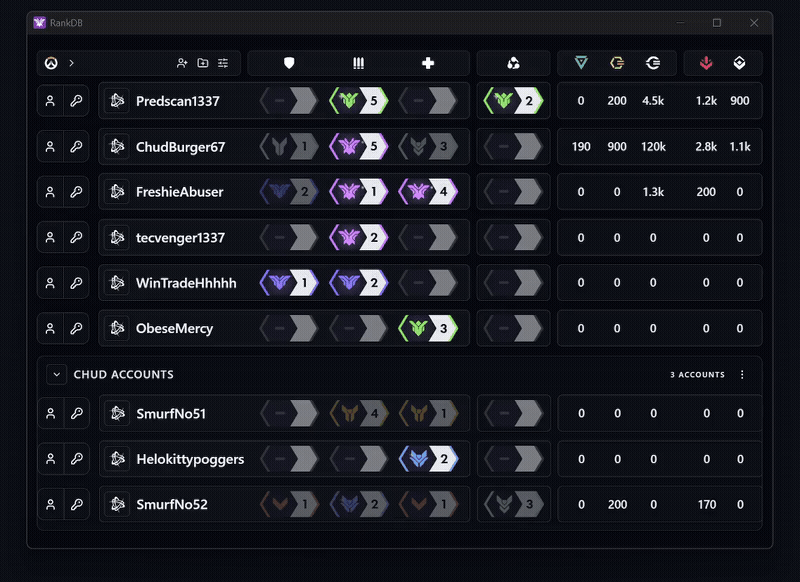

# RankDB

RankDB is a simple desktop app for tracking multiple Overwatch accounts in one place.

It helps you keep ranks, notes, currencies, login details, and account status organized without needing a spreadsheet.

## Features

- Easy access copy Battletag button next to account name
- Credential manager with autodelete from copy-paste. (Password and E-Mail)
- Track Tank, Damage, Support, and 6v6 ranks
- Mark ranks as predicted (P) (shows with lower opacity)
- Refresh account ranks using ow api (very limited)
- Reset Rank button on actual full on rank reset. (resets all ranks for all accounts and keeps previous ranks in account info tab)
- Track Mythic Prisms, Overwatch Coins, Overwatch Credits, Competitive Points, and Legacy Points
- Expandable and collapsable Account Groups (For the actual degenerates with 1million accounts)
- Sorting accounts by rank regardless of groups (click on role icons to sort)
- Move banned accounts into their own section (dont use groups because sorting will keep banned accounts in their own category)
- Export and import all your data in password-protected encrypted backups
- Check for app updates from inside RankDB (doesnt update automatically)
- New additions:
- Themes editor. create, import and export themes or use premade themes that come native with the app
- Privacy Mode (incase you stream the application and dont want everyone to see the Account names)
- Game Dodge counter, log your dodged games to see how long the next comp-ban will be after dodging
- Discord Rich Presence (Discord activity show you using RankDB when its open. hover over rank activity icon to see since when you use it)

## Windows Warning

RankDB is not code-signed right now.

Because of that, Windows may show a warning like `Unknown Publisher` or `Windows protected your PC` when opening the installer.

This is expected for now. A code-signing certificate costs money, and the project does not currently have one.

## Privacy

RankDB is built to keep your data local.

- Your account data stays on your own machine
- Backup exports are password-protected
- Rank refresh only contacts an external service when you choose to use it

As always, keep your PC secure and use a strong device password if you store account details locally.

## Install

Go to the repository `Releases` section and download the latest Windows installer.

After the first install, future updates can be checked from inside RankDB.

## License

This project is licensed under the GNU General Public License v3.0.

See `LICENSE` for details.
